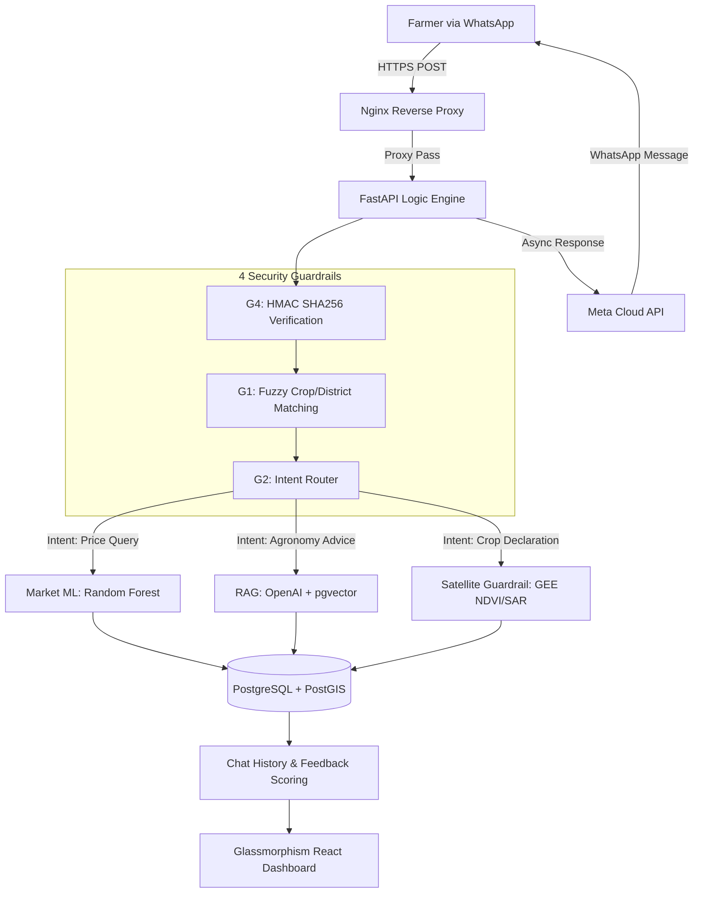

# 📐 KisanMitra System Architecture

This document details the data flow and logical branching of the KisanMitra v2.0 intelligence engine.

## Data Flow Breakdown

### 1. Ingress & Security
The system uses **Nginx** for SSL termination. The FastAPI backend immediately executes **Guardrail 4 (HMAC)** to ensure the message originated from Meta's verified servers. **Guardrail 2** then classifies the intent using deterministic logic.

### 2. Multi-Modal Intelligence
*   **Market Intelligence:** Queries historical Mandi price data and runs a 15-feature Scikit-learn model.
*   **Agronomic Intelligence (RAG):** Performs a cosine-similarity search on `pgvector` stored knowledge chunks. The "Atomic Agronomy" propositions are then synthesized by GPT-4o-mini into a self-contained Kannada response.
*   **Satellite Verification:** Triggers an asynchronous **Google Earth Engine** task. It prioritizes Sentinel-2 (Optical) but falls back to **Sentinel-1 (SAR)** if cloud coverage exceeds 20%.

### 3. Telemetry Loop
Every interaction logs a `ChatHistory` record. When the assistant sends a RAG-based response, it appends **Interactive Buttons**. When a farmer clicks 👍/👎, a secondary webhook updates the `feedback_score`, which is instantly reflected in the **Glassmorphism Dashboard**.
